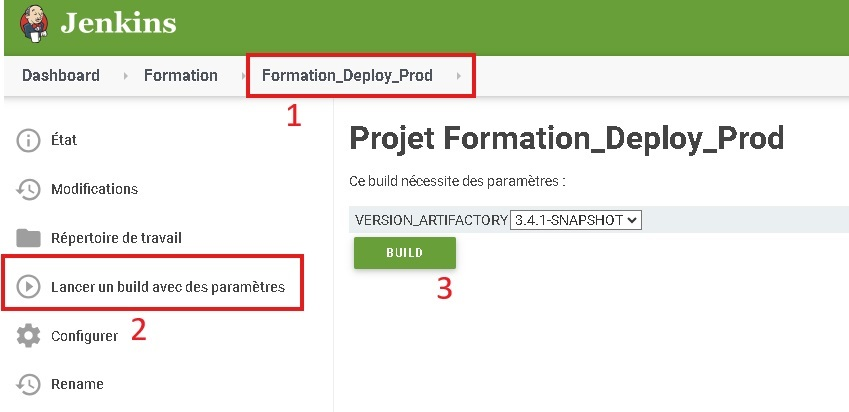

# **1. Procédure de restauration de l'application**

## **Emplacement et restauration des données**
La dernière sauvegarde des données est conservée sous `daily.0` :
- **Base de données** : 62 jours de rétention
- **Fichiers (/applis/)** : 6 jours de rétention

### **1.1 Fichiers**
Les données sont stockées dans le dossier `/applis/bifor/formations/` des serveurs **cirse1** et **cirse2** :
- **Production** : `cirse1-prod.v102.abes.fr`
- **Test** : `cirse1-test.v202.abes.fr`
- **Développement** : `cirse1-dev.v212.abes.fr`

Une copie de sauvegarde est disponible sur **socorro**.

#### **Restauration des fichiers**
Se connecter et synchroniser les fichiers de sauvegarde :
```bash
ssh login@levant.abes.fr@cirse1-prod.v102.abes.fr
rsync -av --progress devel@socorro.v104.abes.fr:/backup_pool/EREBUS/zpool_data/AUTRES/daily.0/bifor/formations/ /applis/bifor/formations/
```

### **1.2 Base de données**
- **Service** : Abes
- **Production** : `orpins-p-scan.v110.abes.fr:1521`
- **Test** : `orpins-t-scan.v110.abes.fr:1521`
- **Développement** : `orpins-d-scan.v110.abes.fr:1521`

Les dumps sont gérés par le **SIAT** et sauvegardés sur **sotora**.

#### **Restauration de la base de données**

1. Se connecter à `ononis` en tant qu'**oracle** :
   ```bash
   ssh oracle@ononis-prod.v106.abes.fr
   ```  
2. Exécuter le script de récupération :
   ```bash
   /home/oracle/_SCRIPTS/restore_bifor.sh
   ```  
   **Ou exécuter manuellement** :
   ```bash
   mkdir -p /backup-sql/ABES/FORMATION/
   rsync -av --progress devel@socorro.v104.abes.fr:/backup_pool/ononis-prod-dumps/daily.0/racine/backup-sql/ABES/FORMATION/dumpBIFOR.dmp /backup-sql/ABES/FORMATION/dumpBIFOR.dmp
   export ORACLE_SID='ABES'
   impdp '/ as sysdba' SCHEMAS=FORMATION dumpfile='/backup-sql/ABES/FORMATION/dumpBIFOR.dmp' logfile=expdpBIFOR.log directory=DPDUMP_BIFOR
   ```  

### **1.3 Déploiement et redémarrage du serveur**
- **Code source** : [`https://github.com/abes-esr/formations-bifor`](https://github.com/abes-esr/formations-bifor)
- **Releases** : [`https://artifactory.abes.fr/artifactory/webapp/#/artifacts/browse/tree/General/libs-release-local/fr/abes/bifor`](https://artifactory.abes.fr/artifactory/webapp/#/artifacts/browse/tree/General/libs-release-local/fr/abes/bifor)

#### **1.3.1 Déploiement depuis Jenkins**
Exécuter le **job de déploiement** depuis le projet **Formation** sur [Jenkins](https://jenkins.abes.fr/view/Formation/) en sélectionnant la release à déployer.

- **Nom du job** : `Formation_Deploy_(DEV_TEST|Prod)`



#### **1.3.2 Redémarrage de Tomcat**
Relancer l'application :
```bash
sudo systemctl restart tomcat8-bifor.service
```  
Si le serveur **Tomcat** est défaillant, contacter le **SIAT** pour réinstaller **Tomcat 8** sur les serveurs `cirse` :
```bash
/usr/local/tomcat8-bifor/
```

# 2. Lancer l'application en local
## 2.1 Création des artifacts
file>Project Structure>Artifacts>add
Web Application:Archive > From Module...

Répéter l'opération pour AGIFAdmin et pour AGIFWeb
## 2.2 Configuration des builds
Ajouter le plugin *Tomcat and TomEE*

Il faut créer une configuration pour chaque application (bifor = admin et formation = stagiaires)

Dans l'onglet "Run Actions" sélectionner le menu déroulant et choisir "Edit configurations...">Add new configuration>Tomcat server - local
Sélectionner la version *Tomcat 8.0.50*

Pour chaque application spécifier une url et un port différent
ex:
```http://localhost:25468/AGIFWeb/```
```http://localhost:8080/AGIFAdmin/```

Pour chacune, dans l'onglet *Before launch*, ajouter dans l'ordre *Build* puis ajouter *Build Artifact* et sélectionner l'artifact correspondant.
## 2.3 Configuration des constantes
Par défaut les constantes se configurent d'après la valeur de Constant.getEnv().
Elles sont définies dans les fichiers */home/tomcat/bifor_conf/config.properties* ainsi que *`/usr/local/tomcat8-bifor/bin/`setenv.sh*